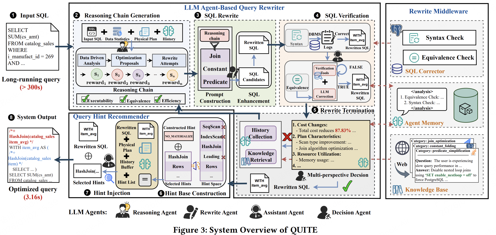
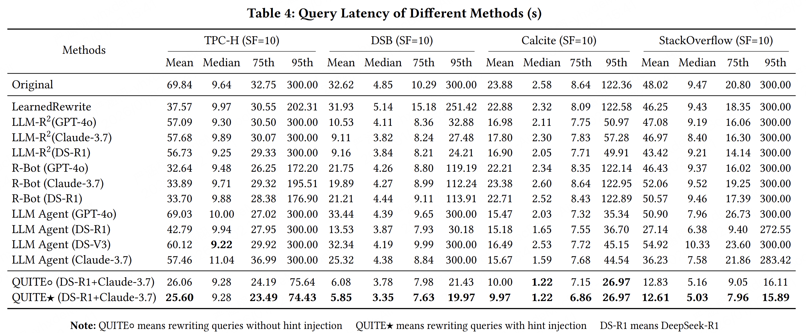
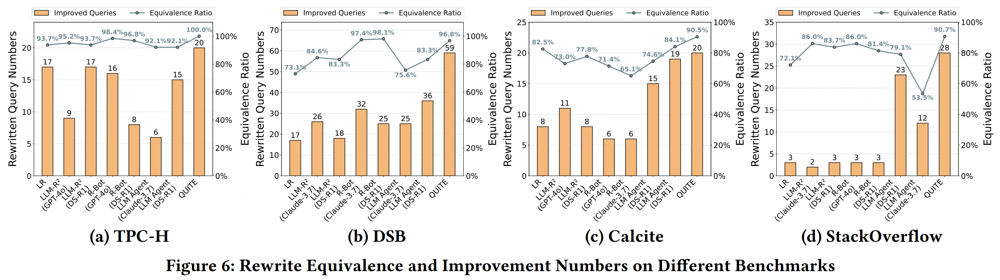

# QUITE: A Query Rewrite System Beyond Rules with LLM Agents

## Table of Contents
- [System Overview](#system-overview)
- [Environment Setup](#environment-setup)
- [Quick Start](#quick-start)
- [Experimental Results](#experimental-results)
- [Rewrite Beyond Rules Discussion](#rewrite-beyond-rules-discussion)
- [Code Structure](#code-structure)

<!-- - [Citation](#citation) -->
## System Overview
<p align="center">
    
</p>

QUITE (<u>QU</u>ery rewr<u>ITE</u>) is a training-free and feedback-aware system based on LLM agents that rewrites SQL queries into semantically equivalent forms with significantly better performance, covering a broader range of query patterns and rewrite strategies.

The figure above presents the query rewrite workflow:

### 🚀 Key Features
- **Training-Free**: No machine learning model training required
- **Multi-Agent Architecture**: Specialized agents for reasoning, verification, and decision-making
- **Feedback-Aware**: Iterative refinement based on execution plan analysis
- **Broad Coverage**: Supports complex query patterns beyond traditional rule-based systems
- **Memory Management**: Efficient context management to prevent hallucinations

## Environment Setup
The following instructions have been tested on Ubuntu 22.04 and PostgreSQL v14.13, Python 3.12.


### Installation

<!-- **Clone the repository:**
```bash
git clone https://github.com/your-repo/QUITE.git
cd QUITE
``` -->

**Install dependencies:**
```bash
pip install -r requirements.txt
```
Note: For the Rewrite Middleware dependencies installation, we have simplified and integrated the installation process as much as possible into our workflow. If there still has any error related to this during runtime, you can check the official document to find help. We use [SQLSolver SIGMOD'24](https://github.com/SJTU-IPADS/SQLSolver) as the start point of our hybrid SQL Corrector, [haystack](https://github.com/deepset-ai/haystack) to build our knowledge base.

**Benchmarks:**

We use TPC-H, DSB, Clacite and SQLStorm to evaluate our system's performance. You can find the construction methods in the following links: [TPC-H](https://github.com/gregrahn/tpch-kit), [DSB](https://github.com/microsoft/dsb), [Calcite](https://github.com/eidos06/SlabCity/tree/main), [SQLStorm](https://github.com/SQL-Storm/SQLStorm).

<!-- 3. **Database Setup:**
```bash
# Install PostgreSQL (Ubuntu/Debian)
sudo apt update
sudo apt install postgresql postgresql-contrib

# Create database and user
sudo -u postgres psql
CREATE DATABASE your_database_name;
CREATE USER your_username WITH PASSWORD 'your_password';
GRANT ALL PRIVILEGES ON DATABASE your_database_name TO your_username;
\q
```

4. **Load Benchmark Data:**
```bash
# For TPC-H benchmark
cd dataset/schemas
psql -d your_database_name -f tpch.sql

# For DSB benchmark  
psql -d your_database_name -f dsb.sql

# For Calcite benchmark
psql -d your_database_name -f calcite.sql
``` -->

## Quick Start

### Step 1: Configuration Setup

#### 1.1 Set up your OpenAI API keys and URL for LLM Agents

Find the `.env` file in the `config_file/` directory. Our default base LLM selection is as follows:

```bash
# config_file/.env
# LLM Model API Configuration
REASONING_MODEL_API_KEY=[your_api_key_here]
REASONING_MODEL=deepseek-r1
REASONING_MODEL_URL=[your_model_url_here]

DECISION_MODEL_API_KEY=[your_api_key_here]
DECISION_MODEL=claude-3-7-sonnet-20250219
DECISION_MODEL_URL=[your_model_url_here]

ASSISTANT_MODEL_API_KEY=[your_api_key_here]
ASSISTANT_MODEL=claude-3-7-sonnet-20250219
ASSISTANT_MODEL_URL=[your_model_url_here]

# Database Configuration
DB_HOST=[localhost]
DB_PORT=[5432]
DB_NAME=[your_database_name]
DB_USER=[your_username]
DB_PASSWORD=[your_password]

# Project Configuration
PROJECT_ROOT=/path/to/QUITE
```
Note: Make sure you have added the **PROJECT_ROOT** path in the `.env` file.

#### 1.2 Test Each Module

We independently test each component of QUITE to ensure that it would function correctly in the new execution environment. The default database is **TPC-H Benchmark** in our code [test_module.py](test_module.py) and [test_query](dataset/queries/test_sql.sql).
 If you use your own database benchmarks, exchange the [test_query](dataset/queries/test_sql.sql) to yours and reconfirm the `.env` file.
```bash
# Test database connection and middleware tools
python test_module.py
```
The system will automatically test each unit to make sure the whole rewrite process stable. You will see the output like this:
```
============================================================
🚀 Starting SQL Optimization Tests
============================================================
......
```
| Test Module | Description | Purpose |
|-------------|-------------|---------|
| **🔌 DBMS Connection** | Tests PostgreSQL database connectivity | Validates database connection and basic operations |
| **🤖 LLM Connection** | Tests all three LLM agents connectivity | Validates Reasoning, Decision, and Assistant agent connections |
| **📊 Data Distribution** | Tests database statistics retrieval | Ensures proper database profiling and statistics collection |
| **🔍 DBMS Explain Tool** | Tests SQL execution plan generation | Validates query plan analysis capabilities |
| **📚 Knowledge Base Tool** | Tests knowledge retrieval system | Validates optimization knowledge base functionality |
| **✅ DBMS Syntax Tool** | Tests SQL syntax validation | Ensures SQL query syntax correctness |
| **🔄 Equivalence Check Tool** | Tests SQL equivalence verification | Validates rewritten query semantic equivalence |

There may be error messages such as database permission issues, LLM connection problems, or path errors. Please adapt the settings according to the actual operating environment.
### Step 2: Prepare Input Queries and Schemas

#### 2.1 Use Provided Query Sets and Schemas

QUITE includes three benchmark query sets and schemas in `dataset/queries/` and `dataset/schemas/`. If you want to use your own query sets and schemas, you can follow the structure of ours.

#### 2.2 Prepare Structured Knowledge Base

You can find our Structured Knowledge Base in [`knowledge_base.json`](src/Rewrite_Middleware/Structured_Knowledge_Base/storage/knowledge_base.json). If you want to construct your own knowledge base, you can refer to our knowledge preparation code in [`data_clean.py`](src/Rewrite_Middleware/Structured_Knowledge_Base/preparation/data_clean.py).

Here is a detailed guideline: [guideline](src/Rewrite_Middleware/Structured_Knowledge_Base/preparation/guideline.md)


### Step 3: Execute QUITE to Rewrite SQL Queries

#### 3.1 Using Automation Scripts (Recommended)

We provide three convenient scripts for different scenarios. 

**Note:** You should enter the following `.sh` files to check the **Input Path**, **Output Path** and the **Schema Path**.

**Option 1: Complete Pipeline (Rewriter + Recommender)**
```bash
# Check the .sh file configurations

# Run the complete pipeline (can be executed from any location within QUITE)
chmod +x ./scripts/run_quite.sh
bash ./scripts/run_quite.sh
```

**Option 2: Query Rewriting Only**
```bash
# Check the .sh file configurations

# Run only the query rewriter (can be executed from any location within QUITE)
chmod +x ./scripts/run_quite_only_query_rewrite.sh
bash ./scripts/run_quite_only_query_rewrite.sh
```

**Option 3: Hint Recommendation Only**
```bash
# Check the .sh file configurations

# Run only the hint recommender (can be executed from any location within QUITE)
chmod +x ./scripts/run_quite_only_hint_injection.sh
bash ./scripts/run_quite_only_hint_injection.sh
```

#### 3.2 Direct Python Execution

You can also run the system directly with custom parameters:

```bash
# Basic usage with both modules
python run.py \
    --input_path dataset/queries/tpch_test.json \
    --output_dir output/my_results \
    --schema_file dataset/schemas/tpch_schemas.sql \
    --enable_rewriter \
    --enable_recommender

# Query rewriting only
python run.py \
    --input_path dataset/queries/tpch_test.json \
    --output_dir output/rewrite_only \
    --schema_file dataset/schemas/tpch_schemas.sql \
    --enable_rewriter

# Hint recommendation only
python run.py \
    --input_path dataset/queries/tpch_test.json \
    --output_dir output/hints_only \
    --schema_file dataset/schemas/tpch_schemas.sql \
    --enable_recommender

# With detailed logging
python run.py \
    --input_path dataset/queries/tpch_test.json \
    --output_dir output/with_logs \
    --schema_file dataset/schemas/tpch_schemas.sql \
    --enable_rewriter \
    --enable_recommender \
    --save_rewriter_logs
```

#### 3.3 Available Parameters

| Parameter | Description | Default |
|-----------|-------------|---------|
| `--input_path` | Input JSON file path containing queries | Required |
| `--output_dir` | Output directory for results | `/root/QUITE/output` |
| `--schema_file` | Path to the database schema file | Required |
| `--enable_rewriter` | Enable query rewriter module | False |
| `--enable_recommender` | Enable hint recommender module | False |
| `--save_rewriter_logs` | Save detailed rewriter logs to txt files | False |
| `--rewriter_batch_size` | Batch size for rewriter | 3 (forced to 1 if saving logs) |
| `--recommender_batch_size` | Batch size for recommender | 3 |
| `--max_iterations` | Maximum iteration loops for query rewriting | 2 |

#### 3.4 Monitor the Process

The system will display real-time progress with tqdm progress bars:

```
🚀 QUITE System Starting...
📂 Input: /root/QUITE/dataset/queries/tpch_test.json
📁 Output: /root/QUITE/output/test
🔄 Rewriter: Enabled
💡 Recommender: Enabled
📝 Rewriter logs: Enabled (batch size forced to 1)

📁 Directory structure created:
   rewriter_temp: /root/QUITE/output/test/rewriter_temp
   recommender_temp: /root/QUITE/output/test/recommender_temp
   output: /root/QUITE/ofutput/test

============================================================
🔄 Starting Query Rewriter
============================================================
📊 Processing 10 queries with batch size 1
📁 Temp directory: /root/QUITE/output/test/rewriter_temp
📝 Save logs: Yes

🔄 Processing Query 1/10 (ID: query_1): 100%|██████████| 10/10 [02:34<00:00, 15.4s/query]

✅ Query Rewriter completed! Processed 10 queries in 10 batches
✅ Merged 10 batch files into /root/QUITE/output/test/rewritten_queries.json
📊 Total queries processed: 10

============================================================
💡 Starting Hint Recommender
============================================================
📖 Loading data from /root/QUITE/output/test/rewritten_queries.json
📊 Processing 10 queries with batch size 3

💡 Processing Hint 1/10 (ID: query_1): 100%|██████████| 10/10 [01:45<00:00, 10.5s/hint]

✅ Hint Recommender completed! Processed 10 queries in 4 batches
✅ Merged 4 batch files into /root/QUITE/output/test/recommended_hints.json
📊 Total queries processed: 10

============================================================
🎉 QUITE System Completed!
============================================================
📝 Query Rewriter Output: /root/QUITE/output/test/rewritten_queries.json
💡 Hint Recommender Output: /root/QUITE/output/test/recommended_hints.json
📁 Output Directory: /root/QUITE/output/test

📊 Final output files:
   rewritten_queries.json: 3,396 bytes
   recommended_hints.json: 3,936 bytes

✨ Processing completed successfully!
```

### Step 4: View the Rewrite Results

#### 4.1 Output Structure

Results are organized in a hierarchical directory structure with temporary and final outputs:

```
output/
├── rewriter_temp/                   # Temporary rewriter batch files
│   ├── batch_1.json                # Query rewriting batch 1
│   ├── batch_1.txt                 # Detailed logs batch 1 (if --save_rewriter_logs)
│   ├── batch_2.json                # Query rewriting batch 2  
│   ├── batch_2.txt                 # Detailed logs batch 2 (if --save_rewriter_logs)
│   └── ...
├── recommender_temp/                # Temporary recommender batch files
│   ├── batch_1.json                # Hint recommendation batch 1
│   ├── batch_2.json                # Hint recommendation batch 2
│   └── ...
├── rewritten_queries.json          # Final merged rewriter output
└── recommended_hints.json          # Final merged recommender output
```

### Step 5: Performance Evaluation

**Note:** You should enter the following `./scripts/evaluation.sh` to check:
- `Queries Path`: the rewritten queries path from QUITE system.
- `Storage Path`: the file with SQL output after evaluation.
- `Filtered Path`: processed experimental data file from storage path.

#### 5.1 Database Restart Requirement

⚠️ **Important:** The evaluation script restarts PostgreSQL between query executions to clear database caches for fair performance comparison. This requires system permissions:

```bash
# Linux (systemd)
sudo systemctl restart postgresql

# Linux (init.d)  
sudo service postgresql restart

# macOS (Homebrew)
brew services restart postgresql
```

If you don't have permission to restart PostgreSQL (e.g., shared database, cloud database, or restricted environment), use the `--no_restart` mode.

#### 5.2 Using Built-in Evaluation Tools

**Option 1: Normal Mode (with database restart)**
```bash
# Requires database restart permission
chmod +x ./scripts/evaluation.sh
bash ./scripts/evaluation.sh
```

**Option 2: No-Restart Mode (for restricted environments)**
```bash
# Use this if you cannot restart PostgreSQL
chmod +x ./scripts/evaluation.sh
bash ./scripts/evaluation.sh --no_restart
```

The `--no_restart` mode:
- Skips database restart operations
- Runs each query **5 times** instead of 3
- Removes the **highest and lowest** execution times
- Averages the remaining 3 runs to mitigate cold-start effects

#### 5.3 Direct Python Execution

```bash
# Normal mode
python evaluation.py \
    -q output/test/rewritten_queries.json \
    -s experiments_results/EXP_result.json \
    -f experiments_results/filtered_result.json \
    -t 300

# No-restart mode
python evaluation.py \
    -q output/test/rewritten_queries.json \
    -s experiments_results/EXP_result.json \
    -f experiments_results/filtered_result.json \
    -t 300 \
    --no_restart
```


## Experimental Results
### Baselines:
We compare QUITE with state-of-the-art methods:
- **[LearnedRewrite SIGMOD'22](https://www.vldb.org/pvldb/vol15/p46-li.pdf)**: A machine learning-based query rewrite system leverages MCTS to search the optimized set of rewrite rules in [Apache Calcite](https://github.com/apache/calcite).
- **[LLM-R² VLDB'24](https://www.vldb.org/pvldb/vol18/p53-yuan.pdf)**: An LLM-based query rewrite system that prepares high-quality rewrite demonstrations for LLM to select the optimized set of rewrite rules in [Apache Calcite](https://github.com/apache/calcite).
- **[R-Bot VLDB'25](https://arxiv.org/pdf/2412.01661)**: An LLM-based query rewrite system
- **LLM Agent (SOTA Models)**: Pure agent approach compared to our system's agent template in [`src/utils/LLM_Agent`](src/utils/LLM_Agent).


### Performance Results
We compare QUITE with state-of-the-art methods on different benchmarks (TPC-H, DSB and Calcite) and metrics (query execution latency, rewritten equivalence rate and rewritten improvement rate). We present the core results in this repository. For more details, please refer to our paper.
<p align="center">
    
</p>
<p align="center">
    
</p>


## Rewrite Beyond Rules Discussion
We have collected and analyzed a set of high-impact rewrite examples and integrated them into our [TPC-H examples](./documents/examples/TPC-H), [DSB examples](./documents/examples/DSB) and [Calcite examples](./documents/examples/Calcite)

In the course of rewriting with QUITE, we discovered a range of strategies previously unmodeled by our rule set. These newly identified techniques can be found in our more detailed [Appendix](./documents/QUITE_Appendix.pdf).


## Code Structure
#### 📊 Data & Configuration
- **`config_file/`**: Environment configuration and API keys
  - `.env`: LLM API keys, database connection settings, project root path
- **`dataset/`**: Benchmark datasets and schemas for evaluation
  - `queries/`: Query sets for TPC-H, DSB, and Calcite benchmarks
  - `schemas/`: Database schemas for different benchmarks

#### 📁 Documents & Examples
- **`documents/`**: Documentation and analysis materials
  - `QUITE_Appendix.pdf`: Detailed MDP-based Reasoning Agent construction and rewritten examples beyond rule expressions
  - `rewrite_types.md`: Classification and description of SQL rewrite types
  - `effective_rewrite_types/`: JSON files categorizing effective rewrite strategies (CTE, Constant, Join, Predicate, Others)
  - `examples/`: Analysis of rewritten queries for representative examples
    - `TPC-H/`: TPC-H benchmark query examples
    - `DSB/`: DSB benchmark query examples  
    - `Calcite/`: Calcite benchmark query examples

#### 📋 Automation Scripts
- **`scripts/`**: Execution scripts for different scenarios
  - `setup_env.sh`: Common environment setup script (auto-detects project root)
  - `run_quite.sh`: Complete pipeline with both rewriter and recommender
  - `run_quite_only_query_rewrite.sh`: Query rewriting only
  - `run_quite_only_hint_injection.sh`: Hint recommendation only
  - `evaluation.sh`: Evaluate the rewrite result in real DBMS 

#### 🔧 LLM Agent-based Query Rewriter
- **`src/Query_Rewriter/`**: Main query rewriting engine
  - `finite_state_machine.py`: Finite state machine orchestrating the complete rewrite workflow
  - `agent_definition.py`: Definitions for Reasoning, Assistant, and Decision agents

#### 🛠️ Rewrite Middleware
- **`src/Rewrite_Middleware/`**: Database interaction and verification tools
  - `middleware.py`: Core tools including DBMS_EXPLAIN_Tool, DBMS_Syntax_Tool, Knowledge_Base_Tool
  - `Agent_Memory_Buffer/`: Advanced memory management for agent context
  - `Structured_Knowledge_Base/`: Knowledge retrieval and management system
  - `Agent_Memory_Buffer`: Memory management to prevent context overflow and hallucinations

#### 💡 Query Hint Recommender
- **`src/Hint_Recommender/`**: Optimization hint generation system
  - `injection.py`: Main hint injection and recommendation engine

#### 🔧 Utilities
- **`src/utils/`**: Shared utilities and base classes
  - `path_config.py`: ensures scripts run correctly from any location within the project
  - `agent_template.py`: Base classes for LLM agents (MessageQueue, MemoryWindow, etc.)
  - `llm_client.py`: Unified LLM client interface supporting multiple models
  - `data_distribution.py`: Database statistics storage and management
  - `get_data_statistics.py`: Automated database profiling and statistics collection

#### 🚀 Entry Points
- **`run.py`**: Main execution script with progress monitoring and batch processing
- **`test_module.py`**: Comprehensive testing suite for all components
- **`evaluation.sh`**: Evaluate the rewritten query performance in real DBMS


<!-- ```
QUITE/
├── config_file/
│   ├── .env                         # Environment configuration file
├── dataset/
│   ├── queries/
│   │   ├── tpch_quries.json         # TPC-H benchmark queries
│   │   ├── dsb_queries.json         # DSB benchmark queries
│   │   └── calcite_queries.json     # Calcite benchmark queries
│   └── schemas/
│       ├── tpch_schemas.sql         # TPC-H database schema
│       ├── dsb_schemas.sql          # DSB database schema
│       └── calcite_schemas.sql      # Calcite database schema
├── documents/
│   ├── Detailed_Appendix.pdf       # Detailed MDP-based reasoning 
│   └── examples/                    # Analysis of rewritten queries 
│       ├── TPC-H/                   # TPC-H query examples
│       ├── DSB/                     # DSB query examples
│       └── Calcite/                 # Calcite query examples
├── scripts/
│   ├── run_quite.sh                 # Complete pipeline execution 
│   ├── run_quite_only_query_rewrite.sh    # Query rewriting only
│   ├── run_quite_only_hint_injection.sh   # Hint recommendation only
│   └── performance_evaluation.sh   # Evaluate rewrite results in real 
├── src/
│   ├── Query_Rewriter/
│   │   ├── finite_state_machine.py  # Main FSM orchestrating rewrite 
│   │   ├── agent_definition.py      # LLM agent role definitions
│   │   └── memory_buffer.py         # Agent memory management system
│   ├── Rewrite_Middleware/
│   │   ├── middleware.py            # Core database interaction tools
│   │   ├── Agent_Memory_Buffer/
│   │   │   └── memory_buffer.py     # Enhanced memory management
│   │   └── Structured_Knowledge_Base/
│   │       ├── storage/
│   │       │   └── knowledge_base.json     # Pre-built knowledge base
│   │   |    ├── preparation/
│   │   |    │   └── data_clean.py    # Knowledge base preparation 
|   |   |
pipeline
│   │       └── scripts/
│   │           └── test.py          # Knowledge base testing utilities
│   ├── Hint_Recommender/
│   │   ├── injection.py             # Main hint injection and recommendation engine
│   │   ├── gpt.py                   # GPT client for hint generation
│   │   └── tools.py                 # Utility tools for hint processing
│   └── utils/
│       ├── agent_template.py        # Base agent template classes
│       ├── llm_client.py           # LLM client interface
│       ├── data_distribution.py     # Database statistics management
│       └── get_data_statistics.py   # Database statistics collection
├── BaoForPostgreSQL/               # PostgreSQL optimization integration
├── MAReter/                        # Multi-Agent Rewriter system components
├── QUITE/                          # Core QUITE system implementation
├── critical_result/                # Critical performance analysis results
├── machine1/                       # Experimental data and benchmark results
├── output/                         # Generated rewrite results and logs
├── utils/                          # Shared utilities and helper functions
├── figures/
│   ├── overview.png                # System architecture diagram
│   ├── query_latency.png           # Performance comparison results
│   └── rewritten_rate.png          # Rewrite effectiveness metrics
├── run.py                          # Main execution script with progress monitoring
├── test_module.py                  # Comprehensive testing suite
├── evaluation.sh                   # Evaluate rewritten queries in real DBMS
├── backup.sh                       # System backup and maintenance script
├── requirements.txt                # Python dependencies
└── README.md                       # Project documentation
``` -->
<!-- ## Citation
If you use this codebase, or otherwise found our work valuable, please cite:
```
@article{song2025quite,
  title={QUITE: A Query Rewrite System Beyond Rules with LLM Agents},
  author={Song, Yuyang and Yan, Hanxu and Lao, Jiale and Wang, Yibo and Li, Yufei and Zhou, Yuanchun and Wang, Jianguo and Tang, Mingjie},
  journal={arXiv preprint arXiv:2506.07675},
  year={2025}
}
``` -->

